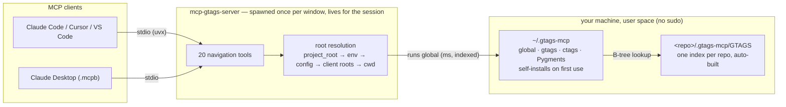
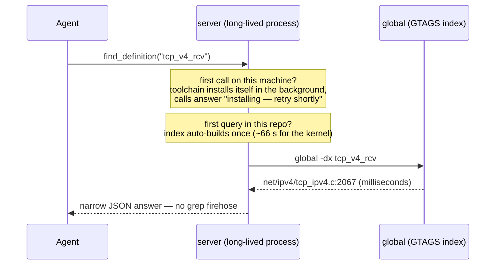

# mcp-gtags-server

> **Stop letting your AI agent grep. Give it an index.**

[](https://pypi.org/project/mcp-gtags-server/)
[](https://github.com/harshithsunku/mcp-gtags-server/actions/workflows/ci.yml)
[](https://github.com/harshithsunku/mcp-gtags-server/actions/workflows/eval.yml)
[](https://www.python.org/downloads/)
[](LICENSE)
[](https://modelcontextprotocol.io/)
[](https://www.gnu.org/software/global/)
[](https://cursor.com/en/install-mcp?name=gtags&config=eyJjb21tYW5kIjoidXZ4IiwiYXJncyI6WyJtY3AtZ3RhZ3Mtc2VydmVyIl19)

mcp-name: io.github.harshithsunku/mcp-gtags-server

```json
{ "mcpServers": { "gtags": { "command": "uvx", "args": ["mcp-gtags-server"] } } }
```

*One user-level config entry, no sudo, no pre-installed anything — the whole toolchain installs itself into user space on first use, and every repo you open is served automatically.*

Every AI coding agent — Claude Code, Cursor, Codex, you name it — answers *"where is this function defined?"* the same way: **grep the entire tree**. On a million-line C/C++ codebase that's a full scan per question, and the output is a firehose: every comment, string literal, and unrelated match, dumped straight into the model's context window.

**mcp-gtags-server** replaces those scans with indexed lookups powered by [GNU Global (gtags)](https://www.gnu.org/software/global/) — the same tags engine kernel and systems developers have trusted for decades — exposed to agents over the [Model Context Protocol](https://modelcontextprotocol.io/). Built for the codebases LSP-based tools can't handle: kernel-scale C/C++, trees that don't currently compile, machines you can't sudo on.

- **~100× faster per query** — milliseconds instead of seconds, at any codebase size
- **Radically less noise** — the definition, not 7,873 lines of matches
- **Speaks kernel** — `#ifdef` guard stacks with `.config` filtering, and macro-generated symbols (`sys_read` → its `SYSCALL_DEFINE3` site) that no other tagging tool resolves
- **Zero index management** — first query builds the index, every query auto-refreshes it
- **Correctness measured in CI** — a 50-case golden eval against a pinned kernel: 100% recall, 100% precision@1 ([docs/capability.md](docs/capability.md))
- **Works everywhere MCP does** — Claude Code, Claude Desktop, Cursor, any MCP client

## The numbers (real Linux kernel, not a toy)

Measured on a full Linux kernel checkout — **65,163 C/C++ files, 37.1 million lines** — warm page cache:

| Question an agent asks | `grep -rn` | gtags (this server) | Context consumed |
|---|---|---|---|
| Where is `tcp_v4_rcv` defined? | 1.40 s | **0.01 s** | 8 lines → **1 line** |
| Where is `kmalloc` defined? | 1.62 s | **0.01 s** | 7,873 lines → **5 lines** |
| Who references `kmalloc`? | 1.62 s | **0.10 s** | 7,873 noisy lines → 2,744 real sites (or a **ranked per-file summary**) |
| Show me `tcp_v4_rcv`'s implementation | *read a 3,500-line file* | **`get_symbol_body`** | **exactly the 271-line function** |
| Who calls `ext4_mark_inode_dirty`? | 245 raw match lines | **`find_callers`** | **62 deduped caller functions, with counts** |
| Where is `sys_read` *really* defined? | *no answer — the name is macro-generated* | **0.03 s** | `fs/read_write.c SYSCALL_DEFINE3(read, ...)`, flagged `resolved_via` |
| Does `ksys_read` ever reach `rw_verify_area`? | *N rounds of grep + reading* | **0.6 s** | the shortest call chain, with every call site's file:line |
| What does my uncommitted diff impact? | *not answerable* | **0.1 s** | `blast_radius`: changed functions + callers, ranked by distance |

One-time index build: **66 s** for the whole kernel. Incremental refresh after edits: well under a second. Reproduce it yourself with [`scripts/benchmark.sh`](scripts/benchmark.sh):

```bash
./scripts/benchmark.sh /path/to/linux tcp_v4_rcv kmalloc ext4_readdir
```

The speed is nice. The real win is **precision**: an agent that gets 5 exact lines instead of 7,873 noisy ones keeps its context window for actual reasoning.

And the answers are *measured*, not assumed: CI runs a [50-case golden eval](evals/golden.jsonl) against pinned kernel v6.16 on every push — currently **100% recall, 100% precision@1** across definitions, macro resolution, references, callers, `#ifdef` guards, and reachability. The full methodology, numbers, and honest limitations live in [docs/capability.md](docs/capability.md).

## Quick start (60 seconds)

### Option A — one config entry (recommended)

Add the server **once, at user level**, and you're done — no installer, no pre-installed gtags, no per-repo setup. The only prerequisite is [`uv`](https://docs.astral.sh/uv/) (or use Option B, which installs it for you).

```bash
# Claude Code (once per device, all repos):
claude mcp add --scope user gtags -- uvx mcp-gtags-server
```

```json
// Cursor (~/.cursor/mcp.json), or any MCP client's global settings:
{
  "mcpServers": {
    "gtags": { "command": "uvx", "args": ["mcp-gtags-server"] }
  }
}
```

Or click the **Cursor one-click install** badge at the top of this page.

On the very first tool call the server bootstraps everything else by itself: GNU Global (prebuilt user-space binaries — no compiler, no sudo), universal-ctags, and Pygments, all into `~/.gtags-mcp`. While that one-time install runs (a few seconds on most platforms), tool calls return a *"toolchain is being installed — retry shortly"* status instead of failing. Opt out with `--no-auto-setup` or `GTAGS_MCP_AUTO_SETUP=0`.

### Option B — one-line installer (shared background server)

**One command. No sudo. Works everywhere** — restricted corporate machines, containers, build servers:

```bash
curl -fsSL https://raw.githubusercontent.com/harshithsunku/mcp-gtags-server/main/scripts/install.sh | bash
```

Everything lands in your home directory — the server (via `uv`), GNU Global, universal-ctags, and Pygments (in `~/.gtags-mcp`). When it finishes, a **shared background HTTP server** is running that every client and IDE window on the machine can point at (`http://127.0.0.1:8383/mcp`), and the exact client configuration is printed to your console.

**Re-run the same command any time:**

- Up to date? → *"Already installed and up to date — nothing to install"*, and the config is printed again.
- New release on GitHub/PyPI? → the package updates, an outdated gtags toolchain is wiped and reinstalled automatically, and the background server restarts on the new version.

### One config, many repos

However you install it, **one user-level entry serves every repo you open** — 20 repos need zero extra installs and zero extra config. Each tool call resolves its project root down this ladder:

1. `project_root` argument on the tool call (agents pass this to target any tree)
2. `--root` flag / `GTAGS_MCP_ROOT` env var
3. `root` in a [config file](#config-files) *(note: pinning a root here defeats multi-repo)*
4. **The client's workspace roots** (MCP roots protocol) — IDEs that advertise their open folders get the right repo automatically, even on the shared HTTP server; with several folders open, agents are asked to pass `project_root`
5. Walk up from the server's working directory to the nearest `.git`/`GTAGS` — this is why stdio servers spawned by Claude Code/Cursor inside a repo just work

That's it. No indexing step, no configuration. Ask your agent *"who calls `tcp_v4_rcv`?"* — the first query in any repo builds that repo's index automatically, and every query after that is answered in milliseconds. Run `mcp-gtags-server doctor` any time to see what the server detects, or `mcp-gtags-server config` to re-print the client configuration.

<details>
<summary><b>Background server details</b> (network access, port, lifecycle)</summary>

The installer runs `mcp-gtags-server --transport http --host 127.0.0.1 --port 8383` in the background (pid: `~/.gtags-mcp/server.pid`, log: `~/.gtags-mcp/server.log`). Environment overrides for the installer:

| Variable | Default | Meaning |
|---|---|---|
| `GTAGS_MCP_PORT` | `8383` | HTTP port |
| `GTAGS_MCP_HOST` | `127.0.0.1` | Bind address — set `0.0.0.0` to reach the server from other devices at `http://<machine-ip>:8383/mcp` |
| `GTAGS_MCP_NO_SERVER` | unset | `1` = don't start a background server |

**Security note:** the HTTP endpoint is unauthenticated. It binds localhost by default; only bind `0.0.0.0` on networks you trust.

</details>

<details>
<summary><b>Manual install</b> (prefer system packages, or already have Global)</summary>

```bash
# 1. GNU Global — EITHER user-space (no sudo):
mcp-gtags-server setup
#    OR a system package:
sudo apt install global      # Debian/Ubuntu
sudo dnf install global      # Fedora
brew install global          # macOS

# 2. The server:
uv tool install mcp-gtags-server        # or: pip install mcp-gtags-server
```

The server finds binaries in this order: `--bin-dir`/`GTAGS_MCP_BIN_DIR`/config `bin_dir` → `~/.gtags-mcp/bin` → `PATH` → `~/.local/bin`.

</details>

<details>
<summary><b>Claude Desktop</b> — extension bundle or manual config</summary>

Easiest: download `mcp-gtags-server.mcpb` from the [latest release](https://github.com/harshithsunku/mcp-gtags-server/releases/latest), drag it into Claude Desktop's Settings → Extensions, and pick your project folder in the setup screen. The gtags toolchain installs itself on first use.

Or add to `claude_desktop_config.json` manually (pin the project since Desktop doesn't launch in your repo):

```json
{
  "mcpServers": {
    "gtags": {
      "command": "uvx",
      "args": ["mcp-gtags-server", "--root", "/absolute/path/to/your/project"]
    }
  }
}
```

</details>

<details>
<summary><b>Pin a project root</b> explicitly</summary>

By default the server uses the client's advertised workspace root (MCP roots protocol) or auto-detects the project root by walking up from its working directory to the nearest `.git` or existing `GTAGS` — so queries from anywhere inside a monorepo resolve to the repo root. Override with `--root /path`, the `GTAGS_MCP_ROOT` env var, or `root` in a config file — or pass `project_root` on any individual tool call to query a different tree. (See ["One config, many repos"](#one-config-many-repos) for the full resolution order.)

</details>

<details>
<summary><b>Config files</b> — per-project and per-user defaults</summary>

Every setting can also live in a TOML file, so teams share defaults through the repo (like `.editorconfig`):

- **Project**: `.gtags-mcp.toml` at the project root
- **User**: `~/.config/gtags-mcp/config.toml`

```toml
# .gtags-mcp.toml
label = "native-pygments"     # force a GTAGSLABEL parser label
bin_dir = "/opt/tools/bin"    # extra directory searched for gtags/global/ctags
skip_globs = ["*.gen.c"]      # never index paths/basenames matching these globs
respect_gitignore = true      # default: index only what `git ls-files` reports
enrich = true                 # default: ctags kind/signature/scope on results
guards = true                 # default: #ifdef guard stacks on results
macro_resolve = true          # default: resolve macro-generated symbols (sys_*, ...)
# root = "/abs/path"          # default project root (user config)
```

Precedence: tool-call argument > CLI flag > environment variable > project config > user config > built-in default.

</details>

## The tools

### Symbol-level tools — the noise killers

**Give the agent the symbol, not the file.**

| Tool | What the agent gets |
|---|---|
| `symbol_info` | **A one-shot overview card** — definitions (with kind, signature, scope, and `#ifdef` guard), reference count, hottest files, `EXPORT_SYMBOL*` status, and which tool to use next. Multiply-defined symbols are explained as "N definitions under M distinct guards"; macro-generated ones resolve with a `resolved_via` flag. The best first query for any unfamiliar symbol. |
| `get_symbol_body` | **Just the source of a definition.** The 271-line `tcp_v4_rcv` function — not the 3,500-line file it lives in. Handles functions, structs, and multi-line macros. |
| `find_callers` | **The call graph, deduplicated.** Every reference mapped to its enclosing function with call counts: 245 raw lines for `ext4_mark_inode_dirty` collapse to 62 callers. |
| `call_hierarchy` | **Multi-level impact analysis.** Who calls X, who calls *those*, up to 5 levels — a cycle-safe, capped tree instead of N rounds of grep. |
| `find_callees` | **The outgoing call graph.** What does this function call? Body-extracted call sites, each verified against the index, split into in-tree (with locations) and external. |
| `reachability` | **"Can this function end up in that one?"** — BFS over the caller graph returns the *shortest* call chain from A to B with the file:line of every call site (`ksys_read → vfs_read → rw_verify_area`), or an honest "no static path" that names the function-pointer caveat. One call instead of a dozen find_callers rounds. |
| `blast_radius` | **What does my diff impact?** Takes `git diff <ref>`, maps changed lines to their enclosing functions via the index, then walks callers outward — results ranked by distance (changed functions first, direct callers next). The pre-merge "what else must I re-check" answer, tied to real git state. |
| `summarize_references` | **A ranked per-file count.** The cheap first move for hot symbols — `kmalloc`'s 2,744 references become one screen of "where usage concentrates". |
| `project_overview` | **Orientation in an unfamiliar repo** — file counts by top-level directory and language, straight from the index. |
| `find_dead_symbols` | **Dead-code candidates** — every symbol a file defines that nothing references. |
| `find_includers` | **Header blast radius** — every file that `#include`s a header, matched by basename. |

A two-level `call_hierarchy` on the kernel's `ext4_mark_inode_dirty` — 87 compact lines instead of dozens of grep rounds:

```text
ext4_mark_inode_dirty  (definition: fs/ext4/ext4_jbd2.h:138)
├─ ext4_rename  fs/ext4/namei.c  (6 sites)
│  └─ ext4_rename2  fs/ext4/namei.c  (1 site)
├─ swap_inode_boot_loader  fs/ext4/ioctl.c  (5 sites)
│  └─ __ext4_ioctl  fs/ext4/ioctl.c  (1 site)
├─ ext4_mkdir  fs/ext4/namei.c  (3 sites)
│  └─ ext4_rename2  fs/ext4/namei.c  (1 site)
...
```

### Core lookups

| Tool | What it does | Underlying command |
|---|---|---|
| `find_definition` | Where is this symbol defined? Falls back to macro-family resolution (`sys_*`, `trace_*`, `DEFINE_*` names) when there's no literal definition | `global -x` + [macro resolution](#macro-generated-symbols-resolve-too-sys_read--syscall_define3) |
| `find_references` | Raw reference lines for a symbol | `global -rx` |
| `find_symbol_usages` | Usages of symbols with no in-tree definition (libc calls etc.) | `global -sx` |
| `grep_project` | Regex search across indexed files | `global -gx` |
| `list_file_symbols` | A file's API surface — every symbol it defines | `global -fx` |
| `complete_symbol` | Symbols starting with a prefix | `global -c` |
| `find_files` | Indexed files whose path matches a regex | `global -P` |
| `index_project` / `update_index` | Force rebuild / refresh (rarely needed — it's automatic) | `gtags` / `global -u` |

Every query tool supports `limit`/`offset` pagination, long-line truncation, and (where it makes sense) `case_insensitive` — output is *engineered* to never flood a context window.

### Structured output (JSON by default)

Since v0.8.0 every tool returns a **machine-readable JSON envelope by default** (pass `format="text"` for the previous human-readable rendering — a breaking change if you parsed the old text):

```json
{
  "tool": "find_definition",
  "root": "/abs/project/root",
  "results": [
    {"symbol": "kmap", "path": "include/linux/highmem-internal.h", "line": 40,
     "col": 22, "kind": "function", "typeref": "void *", "scope": null,
     "signature": "(struct page * page)", "guard": ["CONFIG_HIGHMEM"],
     "snippet": "static inline void *kmap(struct page *page)"}
  ],
  "total": 2, "offset": 0, "truncated": false,
  "next_tools": ["get_symbol_body", "find_callers", "symbol_info"],
  "warning": null
}
```

- Symbol locations always use the stable record schema `{symbol, path, line, col, kind, typeref, scope, signature, guard, snippet}` with repo-relative paths. Keys are only ever added, never renamed or removed — parsers never need to change shape.
- **`kind` / `typeref` / `scope` / `signature` say *what* a symbol is** (since v0.8.1): function vs. macro vs. struct vs. typedef vs. enum constant, its return/target type, its enclosing scope (`enum:color`, `struct:item`), and its parameter list — extracted per file by universal-ctags with **no build and no compile database**, cached, and filled on definition-shaped results (`find_definition`, `symbol_info`, `list_file_symbols`). When universal-ctags isn't available the fields are simply `null`; disable explicitly with `--no-enrich`, `GTAGS_MCP_ENRICH=0`, or `enrich = false` in `.gtags-mcp.toml`.
- **`guard` says *when* a symbol exists** (since v0.9.0): the enclosing `#if`/`#ifdef` stack, outermost first (`[]` = unconditional, `null` = scanning disabled or file unreadable). See the next section — this is the headline feature.
- **`resolved_via` says *how* a symbol was found** when it took macro-family resolution rather than a literal index match (`"macro:SYSCALL_DEFINE"`, `"fuzzy:vfs_read"`) — see [Macro-generated symbols](#macro-generated-symbols-resolve-too-sys_read--syscall_define3).
- `next_tools` tells the agent the highest-value follow-up call for what was (or wasn't) found.
- `total`/`offset`/`truncated` replace the text continuation footer; errors keep the envelope with an `error` field.
- Composite tools return tool-shaped `results` (e.g. `call_hierarchy` a nested caller tree, `find_callees` `{in_tree, external}`, `symbol_info` an overview object, `reachability` a hop chain) inside the same envelope.

### `#ifdef`-aware: know which definition your config actually compiles

Kernel and firmware code defines the same symbol multiple times and lets the
build configuration pick one. Every other no-build tool returns a flat,
unexplained list — an agent happily reads the no-op stub of `kmap` and
reasons its way to a wrong answer. This server reads the preprocessor
conditionals (pure scanning — still no build, no `compile_commands.json`):

```text
Symbol: kmap
  2 definitions under 2 distinct guards:
  [CONFIG_HIGHMEM] defined at include/linux/highmem-internal.h:40 — function kmap(struct page * page) -> void *
  [!CONFIG_HIGHMEM] defined at include/linux/highmem-internal.h:170 — function kmap(struct page * page) -> void *
```

Pass `active_config` — a kernel `.config` path or a macro list like
`"CONFIG_SMP,BITS_PER_LONG=64,!CONFIG_DEBUG"` — to `find_definition`,
`find_references`, or `symbol_info`, and definitions whose guard stack is
**definitely false** under it are dropped (the envelope reports the count as
`config_filtered`). Filtering is deliberately conservative: a `.config` is a
closed world for `CONFIG_*` macros (kbuild semantics, including
`=m` → `CONFIG_X_MODULE` and `IS_ENABLED`/`IS_BUILTIN`/`IS_MODULE`), but
anything unknown (`__ASSEMBLY__`, `ARCH_HAS_*`, arithmetic it can't decide)
never drops a result.

The details are handled so the output stays clean: classic include guards
(`#ifndef FOO_H`) are detected and suppressed, `#elif` chains compose into
explicit conditions (`!CONFIG_X86_64 && CONFIG_X86_32`), comments on
directives are ignored (they lie), and broken/partial files never fail a
query. Disable with `--no-guards`, `GTAGS_MCP_GUARDS=0`, or `guards = false`
in `.gtags-mcp.toml`.

### Macro-generated symbols resolve too (`sys_read` → `SYSCALL_DEFINE3`)

The best-known gap of every tagging tool on the kernel: `sys_read`,
`trace_sched_switch`, and `css_set_lock` have **no literal definition
anywhere** — they are minted by token-pasting macros, and a plain lookup
comes back empty (or worse, returns a same-named test helper). This server
resolves them from the index alone, no preprocessor and no build:

```text
find_definition("sys_read")        → fs/read_write.c:723  SYSCALL_DEFINE3(read, ...)   resolved_via: "macro:SYSCALL_DEFINE"
find_definition("__x64_sys_openat")→ fs/open.c:1385       SYSCALL_DEFINE4(openat, ...) (arch entry-point wrappers map back)
find_definition("trace_sched_switch") → include/trace/events/sched.h:220  TRACE_EVENT(sched_switch, ...)
find_definition("css_set_lock")    → kernel/cgroup/cgroup.c:82  DEFINE_SPINLOCK(css_set_lock);
```

Covered families: `SYSCALL_DEFINE0..6` / `COMPAT_SYSCALL_DEFINE*` (incl.
`__x64_`/`__ia32_`/`__arm64_`/`__se_`/`__do_` wrapper spellings), tracepoints
(`TRACE_EVENT`, `DEFINE_EVENT`, `DECLARE_TRACE`, ...), and the bare-name
definers (`DEFINE_SPINLOCK`, `DEFINE_MUTEX`, `DEFINE_PER_CPU*`,
`DECLARE_BITMAP`, `module_param*`, any `DEFINE_`/`DECLARE_`-shaped macro) —
plus a last-resort fuzzy tier that tries underscore-variant spellings.
Resolved results are flagged with `resolved_via` in the envelope and ranked
ahead of same-named textual shadows; `DEFINE_*` sites rank above their
`DECLARE_*` counterparts. `symbol_info` additionally reports the
`EXPORT_SYMBOL` / `EXPORT_SYMBOL_GPL` variant a kernel symbol is exported
with, in an `exported` field. Costs nothing when a symbol resolves normally
(only family-shaped names like `sys_*`/`trace_*` get the extra indexed
lookups); disable with `--no-macro-resolve`, `GTAGS_MCP_MACRO_RESOLVE=0`, or
`macro_resolve = false`.

### What gets indexed (junk stays out)

Indexing feeds `gtags` an explicit file list instead of letting it walk the tree:

- In a git repository the list comes from `git ls-files` — **`.gitignore` is respected exactly**, so build output, vendored blobs, and generated files never pollute the index. Disable with `respect_gitignore = false` in `.gtags-mcp.toml`.
- Outside git, the tree is walked minus well-known junk directories (`.git`, `node_modules`, `build`, `dist`, `.venv`, ...).
- `skip_globs` in `.gtags-mcp.toml` drops anything else you never want indexed.

Incremental refreshes recollect the list, so newly ignored files drop out of the index and new files appear — automatically.

### The flow that saves your context window

```text
0. project_overview()                        → orient in an unfamiliar repo (12 lines)
1. symbol_info("kmalloc")                    → definitions + usage spread + next step (12 lines)
2. call_hierarchy("ext4_mark_inode_dirty")   → multi-level impact tree (1 line/caller)
3. get_symbol_body("tcp_v4_rcv")             → read the ONE function that matters
4. find_callees("tcp_v4_rcv")                → what it depends on, with locations
5. reachability("ksys_read", "rw_verify_area") → the call chain, one line per hop
6. blast_radius("HEAD")                      → what my edit impacts, ranked by distance
```

A few hundred lines of context total — versus tens of thousands for the grep-and-read-files equivalent.

## Multi-language projects (C + Python + more)

Real projects mix languages — a C core with Python tooling, JS frontends, Go services. The server handles this automatically:

- **Native languages** (C, C++, Java, PHP, Yacc, assembly) use GNU Global's fast built-in parser.
- **Everything else** (Python, Go, Rust, JavaScript, TypeScript, Ruby, ... ~150 languages) is indexed through Global's **ctags + Pygments plugin parsers** — same index, same tools, same queries.

The one-line installer (and `mcp-gtags-server setup`) enables this automatically — it installs universal-ctags and Pygments into user space, and the server switches to the `native-pygments` parser label on its own. Prefer system packages? Those work too:

```bash
sudo apt install exuberant-ctags python3-pygments   # Debian/Ubuntu
sudo dnf install ctags python3-pygments             # Fedora
brew install ctags && pip install pygments          # macOS
```

Now `find_definition("py_util")`, `get_symbol_body` (indentation-aware for Python), `find_callees`, `call_hierarchy` — all work across every language in the tree, in one index.

Force a specific parser label with `--label`, `GTAGS_MCP_LABEL`, or `label` in `.gtags-mcp.toml` (e.g. `default` for native-only, `pygments` for plugin-everything).

**Honest caveats:** for plugin-parsed languages, *definitions* are as accurate as ctags, but *references* are token-based — every occurrence of the name counts, without C-grade semantic reference tracking or local-scope awareness. For C/C++ nothing changes: the native parser still does that part.

## How it works

### Architecture

One long-lived server process per IDE window (stdio) — or one shared HTTP server for the whole machine. Everything heavy lives on disk and is shared: the toolchain installs itself once per machine, the index builds itself once per repo.



### A tool call, end to end

The binary is **not** re-executed per call — the server process stays alive; each call is one JSON-RPC message plus one millisecond-scale `global` subprocess:



- **First query on a tree?** The index is built automatically (the only operation that ever blocks — and only once).
- **Where do the index files go?** Into a single `.gtags-mcp/` folder at the project root — never loose files next to your code. The folder ships its own `.gitignore`, so `git status` stays clean without touching yours. A pre-existing root-level `GTAGS` (from older versions, or your own gtags runs) keeps being used as-is. `mcp-gtags-server doctor` shows the location.
- **Files changed?** A debounced incremental refresh runs **in the background**: queries always answer instantly from the current index while `gtags -i` catches up behind the scenes. Measured on the kernel: queries return in 0.02s while the 25s freshness check runs invisibly. Staleness is bounded by the debounce window; call `update_index` for a synchronous, guaranteed-fresh barrier right after edits.
- **Huge result?** Pagination footers tell the agent exactly how to fetch the next page — or the tool itself suggests a narrower one (`find_callers` on a symbol used in 500+ files points to `summarize_references`).

## FAQ

**Why gtags instead of a language server (LSP)?**
LSP servers give richer semantics but need a working build configuration, per-editor setup, and serious warm-up time on large trees. gtags indexes 37M lines in about a minute with *zero* configuration, handles the kernel-scale codebases LSPs choke on, and its fuzzy parser doesn't care whether the code currently compiles. For C/C++ navigation questions — definition, references, callers — it's the pragmatic sweet spot. (Wrapping clangd for the compile-DB case was considered and deliberately rejected: users who have a working `compile_commands.json` already have clangd and its ecosystem — see [ROADMAP.md](ROADMAP.md).)

**What languages?**
C, C++, Yacc, Java, PHP, and assembly natively — plus Python, Go, Rust, JS/TS, Ruby, and ~150 others via the ctags/Pygments plugin parsers (see [Multi-language projects](#multi-language-projects-c--python--more)).

**Does the agent have to manage the index?**
No. That's the point. Build-on-first-query, background refresh with adaptive debounce, zero blocking — queries never wait for index maintenance. The explicit `index_project`/`update_index` tools exist only as escape hatches (`update_index` doubles as a synchronous freshness barrier after edits).

**Where does the index live? Can I delete it?**
In `.gtags-mcp/` at the project root (self-gitignored). Delete it freely any time — the next query rebuilds it from scratch.

**Will it fight my agent's built-in tools?**
The tool descriptions are written to steer the model: they say *when* to use indexed lookups instead of grep. In practice agents pick the faster, narrower tool naturally.

## Development

```bash
git clone https://github.com/harshithsunku/mcp-gtags-server
cd mcp-gtags-server
uv run --extra dev pytest       # 229 tests; e2e tests auto-skip if GNU Global is absent
npx @modelcontextprotocol/inspector mcp-gtags-server    # poke at it interactively
```

Tests build a real C project in a temp dir and exercise auto-indexing, auto-refresh, caller mapping, body extraction, pagination, user-space binary discovery, and config layering end-to-end.

Correctness is also measured, not assumed: `mcp-gtags-server eval --golden evals/golden.jsonl --root <kernel-tree>` runs a 50-case golden set (definitions, macro resolution, references, callers, guards, reachability) against a real kernel and prints recall / precision@1 — CI does this weekly against a pinned tag. See [docs/capability.md](docs/capability.md) for the current numbers.

Release flow: bump `version` in `pyproject.toml`, tag `vX.Y.Z`, push — CI publishes to PyPI and users pick the update up on their next installer re-run. Prebuilt GNU Global binaries are rebuilt by tagging `global-v<version>`.

## Roadmap

See [ROADMAP.md](ROADMAP.md) — structured JSON output landed in v0.8.0, ctags
metadata enrichment (kind/signature/scope) in v0.8.1, `#ifdef`/config-guard
awareness (the headline capability for kernel and firmware trees) in v0.9.0,
then, all shipped in v1.0.0: macro-family symbol resolution (`sys_read` → its
`SYSCALL_DEFINE3` site), the agent workflow tools (`reachability`,
`blast_radius`), automatic recovery from corrupted index databases, and the
correctness eval harness — a 50-case golden set against pinned kernel v6.16
scoring 100% recall / 100% precision@1 in CI, with the measured writeup in
[docs/capability.md](docs/capability.md). Every technical milestone is done;
what remains is distribution (MCP registry, directories, the writeup post).

Contributions welcome — open an issue or PR.

## License

[MIT](LICENSE) © Harshith Sunku
