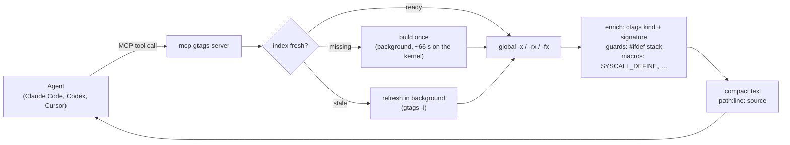

# mcp-gtags-server

**Indexed C/C++ code navigation for AI coding agents.** Your agent asks "who calls
this function?" and gets 62 deduplicated callers with their call lines in
milliseconds — instead of grepping 37 million lines and pouring 7,873 matches into
its context window.

Built on [GNU Global (gtags)](https://www.gnu.org/software/global/) and exposed over
the [Model Context Protocol](https://modelcontextprotocol.io/), for the codebases
language servers struggle with: kernel-scale C/C++, trees that don't currently
compile, machines you can't `sudo` on.

```bash
claude mcp add --scope user gtags -- uvx mcp-gtags-server
```

That single entry serves every repository you open. On the first tool call the
server installs its own toolchain into `~/.gtags-mcp` (no sudo, no compiler) and
builds the index itself. See [Install](install.md) for Codex, Cursor and the
plugin.

## Why it exists

Every coding agent answers code questions the same way: grep the tree. That works,
until the tree is large and the symbol is popular.

| Question | grep | this server |
|---|---|---|
| Where is `tcp_v4_rcv` defined? | 1.40 s, 8 lines | **0.01 s**, 1 line |
| Where is `kmalloc` defined? | 1.62 s, 7,873 lines | **0.01 s**, 5 lines |
| Who calls `ext4_mark_inode_dirty`? | 245 raw match lines | **62 caller functions**, each with its call line |
| Every `mutex_lock` call in `fs/ext4`? | 22,905 tree-wide matches | **18 real sites**, 0.01 s |
| Where is `sys_read` *really* defined? | no answer — the name is macro-generated | `fs/read_write.c` `SYSCALL_DEFINE3(read, …)` |
| Does `ksys_read` reach `rw_verify_area`? | several rounds of grep + reading | the shortest call chain, one call |

Measured on a full Linux kernel checkout: 65,163 C/C++ files, 37.1 million lines.
One-time index build ≈ 66 s; incremental refresh after edits, well under a second.

## What makes it different

- **No build required.** No `compile_commands.json`, no working toolchain, no
  compilation database. It indexes source as text, so it works on trees that don't
  build, cross-compiled firmware, and vendor BSPs.
- **`#ifdef`-aware.** Every definition carries its `#if`/`#ifdef` guard stack, and
  a real kernel `.config` filters out the variants your build can't compile.
- **Speaks kernel.** Macro-generated symbols resolve (`sys_read` → its
  `SYSCALL_DEFINE3` site), and definitions GNU Global's parser misses are recovered
  from their `EXPORT_SYMBOL*` site.
- **Written for agents.** Compact `path:line: source` output, bounded pages, and
  every result naming the most useful next tool.
- **Measured, not asserted.** A 64-case golden eval runs against a pinned kernel in
  CI: 100% recall, 100% precision@1. See [Measured capability](capability.md).

## Start here

<div class="grid cards" markdown>

- **[Install](install.md)** — Claude Code, Codex, Cursor, Claude Desktop, or a shared HTTP server.
- **[Tools reference](tools.md)** — all 8 tools, their parameters, and real output.
- **[Output format](output.md)** — the compact text rows and the JSON envelope.
- **[Kernel & C features](kernel.md)** — guards, `.config` filtering, macro symbols.
- **[Plugin & slash commands](plugin.md)** — one install that adds the skill and `/gtags:impact`.
- **[Troubleshooting](troubleshooting.md)** — errors, timeouts and what they mean.

</div>

## How it works



The index lives in `.gtags-mcp/` inside the project (self-gitignoring), queries
auto-refresh it in the background, and [`update_index`](tools.md#update_index) is
the synchronous barrier when an edit must be visible immediately.
